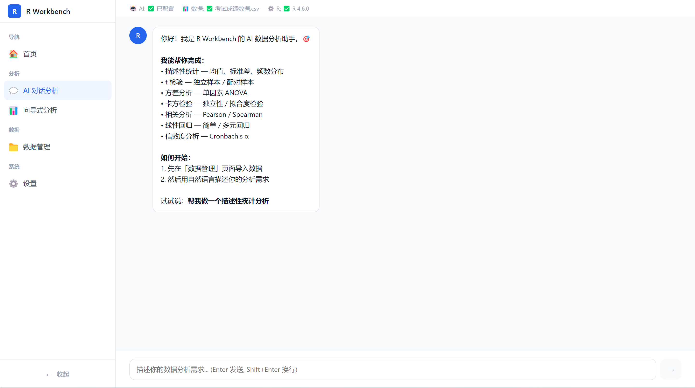
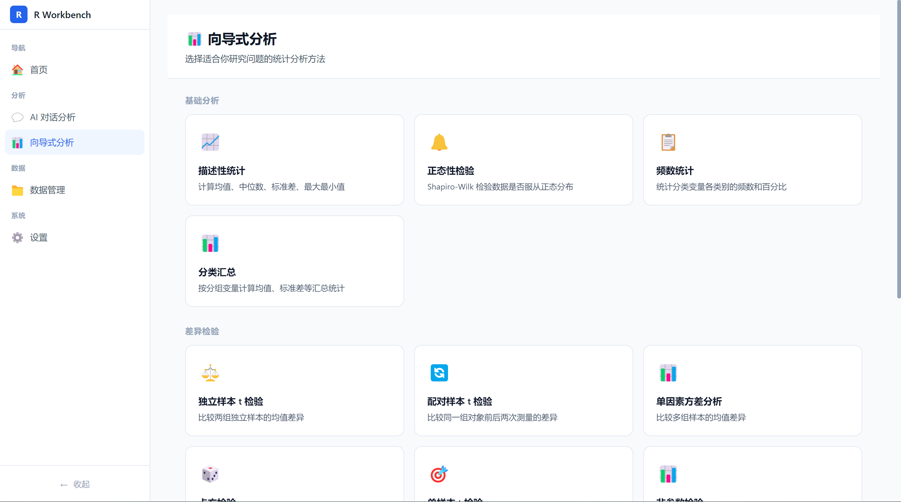
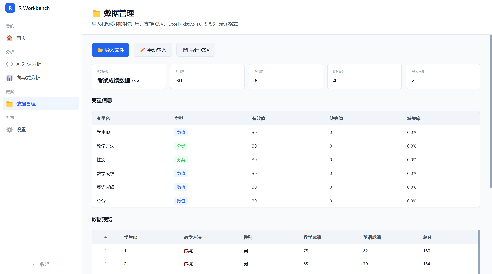
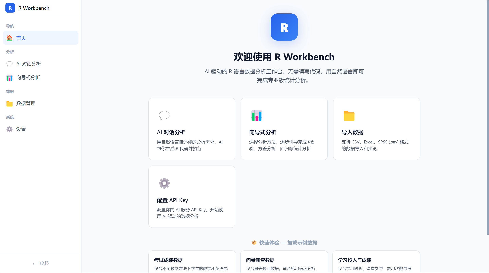

# R Workbench

> 🧪 AI 驱动的 R 语言数据分析工作台 — 替代 SPSS 的开源方案

[](LICENSE)
[]()

## 简介

R Workbench 是一款面向统计学初学者的 AI 驱动数据分析桌面应用。通过**对话式**和**向导式**两种交互模式，让用户无需编写代码即可完成专业级统计分析，替代昂贵的 SPSS 商业软件。

### 截图

| AI 对话分析 | 向导式分析 |
|-------------|-----------|
|  |  |

| 数据管理 | 设置 |
|----------|------|
|  |  |

### 目标用户

- 🎓 统计学相关的专科生、本科生、入门研究生
- 📝 需要完成毕业论文数据分析的学生
- 📄 需要发表期刊论文的研究者
- 💻 想学习 R 语言但觉得门槛太高的初学者

## 核心功能

### 💬 AI 对话分析
- 用自然语言描述分析需求
- AI 自动生成 R 代码并解释
- 一键执行代码，查看结果
- 支持 OpenAI / DeepSeek / 通义千问等 API

### 📊 向导式分析
- 13 种常用统计分析方法：
  - 描述性统计 / 频数统计 / 分类汇总
  - 独立样本 t 检验 / 配对样本 t 检验 / 单样本 t 检验
  - 单因素方差分析 (ANOVA)
  - 卡方检验 / 正态性检验 / 非参数检验
  - Pearson / Spearman 相关分析
  - 线性回归
  - Cronbach's α 信度分析
- 分步引导，自动选择变量
- 自动生成 R 代码并执行

### 📈 可视化图表
- 6 种学术规范图表：
  - 散点图（+ 回归线 + R²）
  - 直方图（+ 正态曲线）
  - 箱线图（分组对比）
  - 柱状图（+ 误差线）
  - 折线图（趋势展示）
  - 核密度图
- 学术主题模板（APA 规范）
- 导出 PNG 图片（300/600 DPI）

### 📁 数据管理
- 支持 CSV、Excel (.xlsx/.xls)、SPSS (.sav) 格式
- 数据预览与变量信息展示
- 自动识别变量类型（数值/分类）
- 缺失值统计

### 📄 结果导出
- 学术三线表展示（APA 规范）
- AI 自动生成结果解读
- 一键复制到 Word（三线表格式）
- 导出 Word 格式分析报告

## 技术栈

| 模块 | 技术 |
|------|------|
| 桌面框架 | Electron 33 |
| 前端 | React 19 + TypeScript 5 + Vite |
| 构建工具 | electron-vite |
| UI 样式 | 自定义 CSS（中文优化） |
| 数据解析 | xlsx (SheetJS) + papaparse + sav-reader |
| R 执行 | child_process + Rscript |
| 绘图 | ggplot2 |
| AI 接口 | OpenAI 兼容 API |
| 报告导出 | OfficeCLI |
| 打包 | electron-builder (NSIS) |

## 快速开始

### 前置条件

1. **Node.js** >= 18
2. **R 环境** >= 4.0 ([下载 R](https://cran.r-project.org/bin/windows/base/))
3. **AI API Key**（任选一个服务商）：
   - [OpenAI](https://platform.openai.com/api-keys)
   - [DeepSeek](https://platform.deepseek.com/)
   - [通义千问](https://dashscope.console.aliyun.com/)

### 安装运行

```bash
# 克隆项目
git clone https://github.com/your-repo/r-workbench.git
cd r-workbench

# 安装依赖
npm install

# 开发模式运行
npm run dev

# 构建生产版本
npm run build

# 打包 Windows 安装程序
npm run build:win
```

### 首次使用

1. 启动后进入「设置」页面配置 AI API Key
2. 回到首页，点击「示例数据」快速体验
3. 使用「向导式分析」或「AI 对话」完成分析

## 项目结构

```
r-workbench/
├── src/
│   ├── main/                    # Electron 主进程
│   │   ├── index.ts             # 窗口管理
│   │   └── ipc.ts               # IPC 处理器（文件/数据/R执行）
│   ├── preload/                 # 预加载脚本（安全桥接）
│   │   └── index.ts
│   ├── renderer/                # React 渲染进程
│   │   ├── src/
│   │   │   ├── components/      # 通用组件
│   │   │   ├── contexts/        # React Context
│   │   │   ├── data/            # 示例数据
│   │   │   ├── pages/           # 页面组件
│   │   │   ├── services/        # 服务层（AI/R/数据/图表）
│   │   │   └── styles/          # CSS 样式
│   │   └── index.html
│   └── shared/                  # 共享类型定义
│       └── types.ts
├── resources/                   # 应用资源
├── electron.vite.config.ts      # electron-vite 配置
├── electron-builder.json5       # 打包配置
└── package.json
```

## 开源许可

[MIT License](LICENSE)

## 致谢

- [R 语言](https://www.r-project.org/) — 统计计算与图形
- [Electron](https://www.electronjs.org/) — 跨平台桌面框架
- [React](https://react.dev/) — 用户界面库
- [ggplot2](https://ggplot2.tidyverse.org/) — 数据可视化

---

**R Workbench** — 让每个人都能轻松完成专业数据分析 🚀
